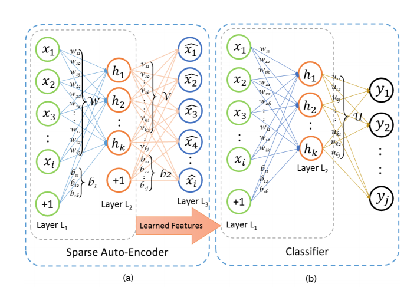
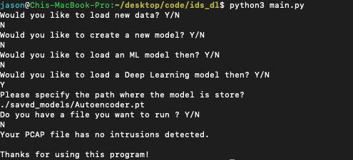

# IDS/IPS with Deep learning - A Pytorch implementation of a proof-of-concept Intrusion Detection and Prevention system

## Introduction

This repository is my implementation of a research paper about building Intrusion Detection Systems with Deep Learning. The main model used is a sparse autoencoder connected with a softmax classifier. The link to the actual paper is here: [Link to paper](https://eudl.eu/pdf/10.4108/eai.3-12-2015.2262516)

## Brief overview of models

The model I implemented with pytorch can be found in the `autoencoder.py` file.
Here's the structure of the neural network:

The other models used contains a Random Forest model, a Logistic Regression Model and a ID3 Decision Tree.

## Methodology

In this project, the ISCX dataset mimics a real life scenario where less than 10% of data regarding intrusions. Due to the data's highly imbalanced nature, I've decided to train each model by downsampling the data first. Whilst the downsampling decreases the accuracy slightly, it significantly increases precision and recall.

## Model Performance

> These are all testing metrics based on a 3/7 train test split. (Ranked according to best eval metrics)

| Model               | Accuracy               | Precision           | Recall              |
| ------------------- | ---------------------- | ------------------- | ------------------- |
| ID3 Decision Tree   | 99.74%                 | 99.80%              | 99.74%              |
| Random Forest       | 98.05%                 | 97.45%              | 98.05%              |
| Sparse Autoencoder  | 97.17%                 | N/A                 | N/A                 |
| Logistic Regression | 70.67%                 | 80.43%              | 70.68%              |

## Sample Use Case + Quick Start Guide

> To run the program, simply install all required dependencies and run the app through `python3 main.py`.

**Note that all data run with this program must be first parsed through the CICFlowMeter.**

Here's a sample flow of predicting network intrusion with the sparse autoencoder.

[Link to Flowmeter](https://github.com/ISCX/CICFlowMeter)

## Final overview of repository

This repository contains the following: 

1. A python script that downloads the raw csv files needed for sampling.

> To download the data from ISCX, make sure you have python 3.x installed and run `python3 downloadData.py`. Then, wait until it prompts that the download is complete. The total file size is around 887 mb and would take rather long...

2. A Jupyter notebook that contains my proof of concept code for a deep learning framework that detects intrusions. It also contains everything from data wrangling to creating baseline models such as KMeans and an Autoencoder network.

> To run the notebook above, have Anaconda installed and run `jupyter notebook POC.ipynb` in the downloaded repository.

3. A set of python scripts that walkthrough all the steps needed to build a model for prediction.

> To ensure the data is compatible with the model, make sure to run the PCAP file through ISCX's CICFlowMeter. Then, simply run `python3 main.py` and the program will step you through the model building process.